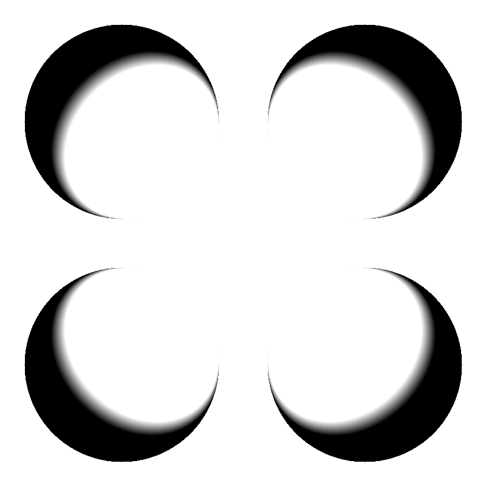
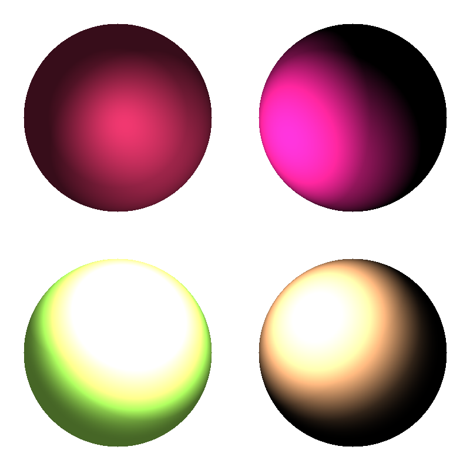
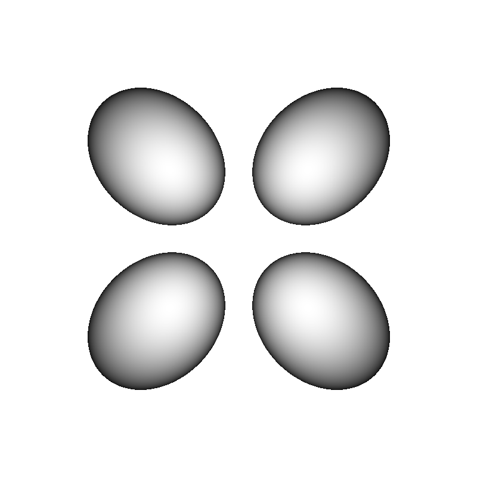
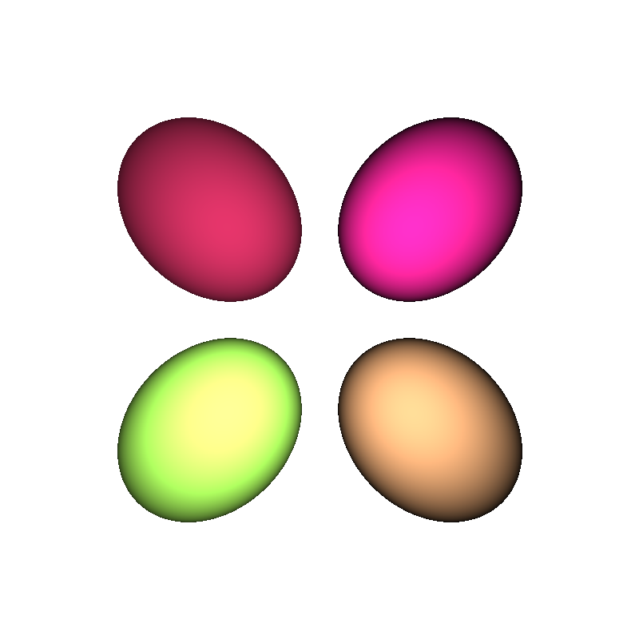

# Ray Tracing

In this project I wrote a raytracer which can be used to render spheres and more complex triangulated surfaces.

Files that I created: main.cpp, shape.cpp, sphere.cpp, ray.cpp, triangle.cpp

## Compilation instructions
In the terminal, after make in the build directory
go to the src directory:
```
clang++ -std=c++17 -stdlib=libc++ main.cpp -o main.out
./main.out
```

## 1.1 Ray Tracing Spheres

I modified the sample code and made it a simple raytracer. I created classes Ray and Sphere in order to make the position of the spheres and the collision code becom general. Four spheres are located in different quadrants. The view point set in (0,0,1) which is facing towards the -z axis. Lambertian shaidng is used in this scene.



## 1.2 Shading

For the specular diffusion, I calculate h which is the bisector of v and l. By changing the coefficients k_a, k_d, k_s, p, we are able to change the material of the sphere. In this picture, the red is purely diffuse and the brown ball is specualr. Notice that ambient light is also added in the other two spheres.  



## 1.3 Perspective Projection

In order to convert the scene into perspective projection, we only need to change the origin of the pixel to be the eye position, and change the direction to be the intersection towards the eye. We also need to set Depth of field d. In this case, I set d = 0.58, e = (0,0,1). Here are the re-renderings of the above scenes.




## 1.4 Ray Tracing Triangle Meshes

created Eigen arrays V, F to store the vertices and the facades of the mesh. Triangle Class is created as a child of the Shape Class. With V and F, I created 1,000 triangles as total. Just like what I did above, for each pixel in the viewport, I try to check whether the ray of this pixel intersect with any of the triangles. 

However, the program took too long to finish. I can only show a small triangle example so far. There could be something wrong with my running mode or algorithm. 

Uncomment this line in main.cpp, it might works in some other laptops.  
```
224    //rayTracerMesh("../data/bunny.off");
```


